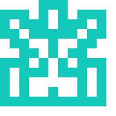

 
 
 
 

    
     
     
    <b>PingPongGod · This is a <a href="https://www.zilch.dev">Zilch</a> bot · Game <a href="https://www.zilch.dev/table-tennis">Table Tennis</a></b>
     
     
    

 
 

## Step 1 › Open Editor

_Open **PingPongGod** in a code editor._

⭐ **[Go to codespaces.new/zhuasy/pingponggod ›](https://codespaces.new/zhuasy/pingponggod?quickstart=1)**

Opening this bot in [GitHub Codespaces](https://docs.github.com/en/codespaces) will get you up and running instantly with a pre-configured development environment. It's the easiest way to get started. If you don't want to use GitHub Codespaces clone the repository on your machine then open it using a code editor of your choosing. Zilch recommends [VSCode](https://code.visualstudio.com/).

 

## Step 2 › Connect to Zilch

_Connect **PingPongGod** to Zilch with the `./connect` (or on Windows `.\connect.cmd`) command._

[Open a terminal](https://code.visualstudio.com/docs/terminal/basics), `cd` to the bot directory if needed, run `./connect` and follow the in-terminal instructions. This will establish a connection between Zilch and PingPongGod. If you encounter any issues see the [detailed setup instructions](#detailed-setup-instructions) below.

 

## Step 3 › Have Fun

_Play a game with **PingPongGod**._

Head back over to [Zilch](https://www.zilch.dev/table-tennis), select some bots, then press **Start Game**. If everything works, congrats! Now it's time to level up your coding skills. Checkout the below [resources](#resources) if you need a hand.

 

### Resources

Need a hand? Here are some spots to head for help.

🤖 [Bot building docs ›](https://www.zilch.dev/docs/building-bots)

💬 [Discord server ›](https://discord.gg/eFNVTn5tY8)

📖 [Zilch blog ›](https://www.zilch.dev/blog)

 

### Detailed Setup Instructions

Nothing here :)
